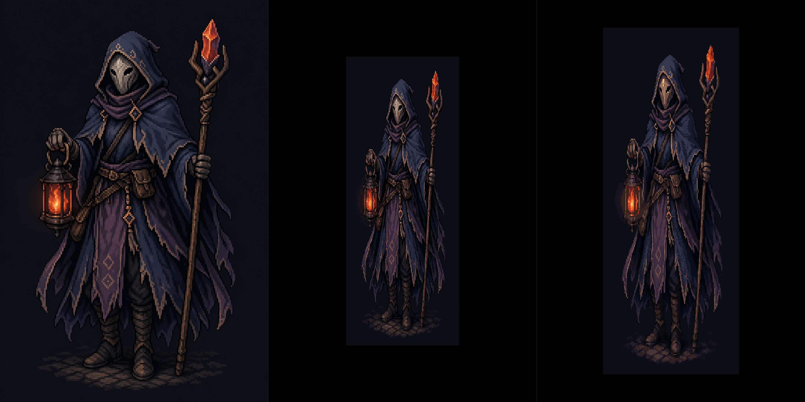

# Pixel Art Lab

Local browser tool for converting AI-generated or faux pixel art into a strict pixel grid while preserving rare colors, silhouettes, and one-pixel details.

It is designed for agent/operator work: an agent starts the local service, the operator imports one image, tunes the live preview, and exports the result.

## Key Capabilities

- Browser sessions are isolated by cookie, so multiple operators can use one running service at the same time without sharing the loaded source image, render cache, or render lock.
- Automatic hidden-grid detection estimates the source mixel cell size and suggests candidate real pixel resolutions.
- Grid Snap transfers enlarged AI pseudo-pixels to a strict pixel grid without averaging away one-pixel strokes; the UI can switch between the phase-aligned legacy uniform grid and elastic cut detection with selectable axis repair.
- Adaptive ordered dithering applies texture only where it helps smooth areas, while avoiding detailed edges and objects.
- Edge-safe bilateral smoothing can reduce noisy flat areas while refusing to blur across contours, black strokes, and local detail jumps.
- Palette builders preserve rare colors, including saturated accents and pale neutral tones such as masks, whites, grays, and ivory highlights.
- A deterministic `kmeans` palette builder is available as a baseline against the richer projected strategies.
- Source alpha is preserved by default through crop, resize, grid snap, and export, with a visible `preserve alpha` toggle when a flat PNG is needed.
- RGB/OKLab palette distance modes, edge-aware palette weighting, rare hue protection, and tonal rare-cell reservation are available for comparison.
- Live preview supports cursor-centered zoom, clamped panning, full-frame hold-before compare, and local `Z` hover comparison.
- All processing is local to the Python server; imported images are not uploaded to a remote service.



## Features

- Hidden-grid transfer for GPT/imagegen "mixel" art.
- Palette builders that keep rare hues, accents, shadows, and outlines.
- Output dimensions locked to the source aspect ratio, with source-height capped at 1024 px.
- Zoom at cursor, clamped panning, and `Z` hover compare against the imported original.
- Topbar `Hold Before` button that draws the imported original over the whole output only while pressed.
- Designer-styled local tooltips for controls and palette swatches; browser-native `title` tooltips are not used.
- Local-only processing. Images are uploaded only to the local Python process.
- `Open from server` browses images under the sibling project folder `assets/generated/**` when Pixel Art Lab is run from this repository layout.
- `Save` writes the current output back over the server image opened through `Open from server`; `Save As` keeps the previous browser download behavior.
- Custom browser presets for every conversion setting, including disabled conditional controls.

## Requirements

- Python 3.11+
- A local browser
- Python packages from `requirements.txt`

```sh
python3 -m venv .venv
. .venv/bin/activate
python -m pip install -r requirements.txt
```

## Run

```sh
python3 pixel_art_lab.py --host 127.0.0.1 --port 8767 --no-browser
```

Open the printed URL:

```txt
http://127.0.0.1:8767/
```

If `8767` is busy, the service automatically tries the next 49 ports.

## Basic Workflow

1. Import one image in `Start`, or use `Open from server` to browse the local `assets/generated/**` tree.
2. Set width or height in `Output & Dither`. With `lock source aspect` enabled, the other side updates after Enter or field blur.
3. Choose a palette strategy in `Palette Builder`.
4. Enable `Grid Snap` in `Hidden Grid` for generated art that contains enlarged pseudo-pixels.
5. Wheel zooms at the cursor. Drag pans. Hold `Hold Before` to overlay the full imported original, or hold `Z` over the preview to compare a local original/output region.
6. Use `Save` to overwrite the opened server image, or `Save As` to download a PNG. You can also save your complete current controls as a JSON settings file.

## Examples

- [Example: GPT Character Generation, Mixels](docs/examples/README.md)

## Starting Settings

For GPT/imagegen pixel art with visible mixels:

```txt
Grid Snap: on
auto size from detected mixels: on
quantize before grid vote: off
Cell reducer: nearest center sample
Palette strategy: projected-rare
Color distance: weighted RGB
Colors: 64
Dither: ordered Bayer if smooth backgrounds need texture, otherwise none
Dither scope: adaptive smooth areas
Bilateral safe edges: on if smoothing is needed
```

For larger environment concepts where color richness matters:

```txt
Grid Snap: off unless the source has obvious mixels
Palette strategy: projected-mass or projected-rare
Colors: 128-256
Resample: box or lanczos
preserve luma: on if brightness drifts
preserve saturation: on if accents wash out
```

## CLI Example

The GUI uses `pixel_art_grid.py` internally. The converter can also run directly:

```sh
python3 pixel_art_grid.py input.png \
  --output output-1024.png \
  --size 1024x576 \
  --colors 64 \
  --palette-strategy projected-rare \
  --dither none \
  --preview-scale 2
```

For agent batch work, pass an input directory and output directory. Pixel Art Lab mirrors subfolders and writes PNG outputs, palettes, manifests, and previews when requested:

```sh
python3 pixel_art_grid.py source-dir \
  --output converted-dir \
  --size 320x180 \
  --colors 64 \
  --grid-snap \
  --palette-strategy kmeans \
  --preview-scale 2
```

## Files

- `pixel_art_lab.py` - local web GUI and API server.
- `pixel_art_grid.py` - conversion pipeline and command-line converter.
- `requirements.txt` - Python dependencies.
- `docs/pixel-art-lab.md` - detailed notes on grid snap, palettes, dithering, caching, and performance rules.

## Agent Runbook

Use this exact command when launching the service for an operator:

```sh
python3 pixel_art_lab.py --host 127.0.0.1 --port 8767 --no-browser
```

Then send the operator the printed URL and keep the process running.

## Publish Separately

This folder is self-contained. To publish it as its own repository:

```sh
cd pixel-art-lab
git init
git add .
git commit -m "Initial Pixel Art Lab"
```

## Performance

The heavy image stages use NumPy and Numba. The first render after enabling a Numba-backed feature can include JIT compilation time; later renders reuse compiled kernels and cached stages. New hot-path algorithms should be implemented in NumPy or Numba before being exposed in the GUI.
