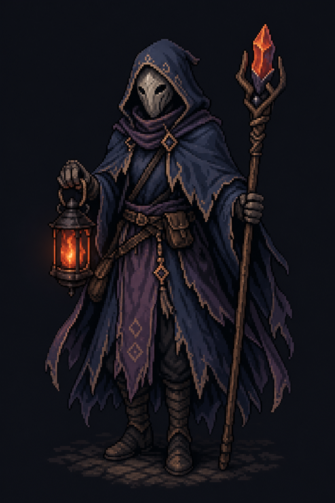

# Examples

## Example: GPT Character Generation, Mixels

This source image is a GPT/imagegen-style pixel-art character with visible pseudo-pixel cells, or mixels. Use it as a starting test image for hidden-grid detection, grid snap, rare-color palette projection, and dark-stroke preservation.

## Original And Pixel Art Lab Variants

Left to right: original GPT/imagegen mixel source, variant 2, variant 1. The variants are cropped to their active art area and matched to the original aspect ratio. Use nearest-neighbor only when the comparison export is being enlarged; downscaled comparison exports must use a proper downscale filter.

